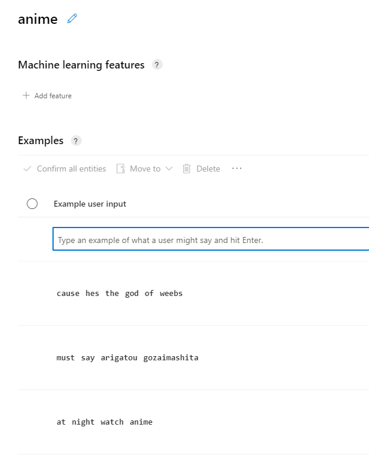
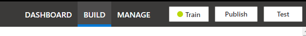
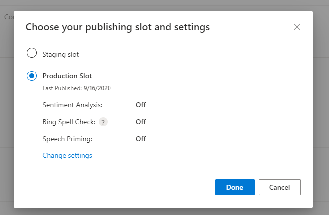
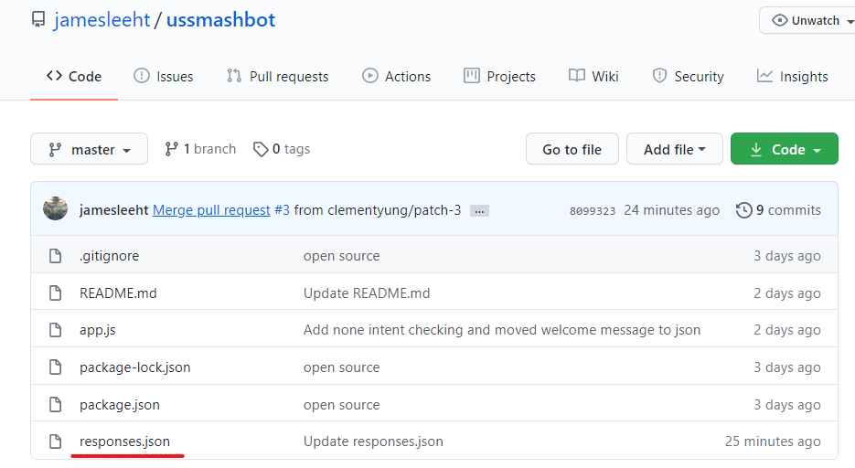
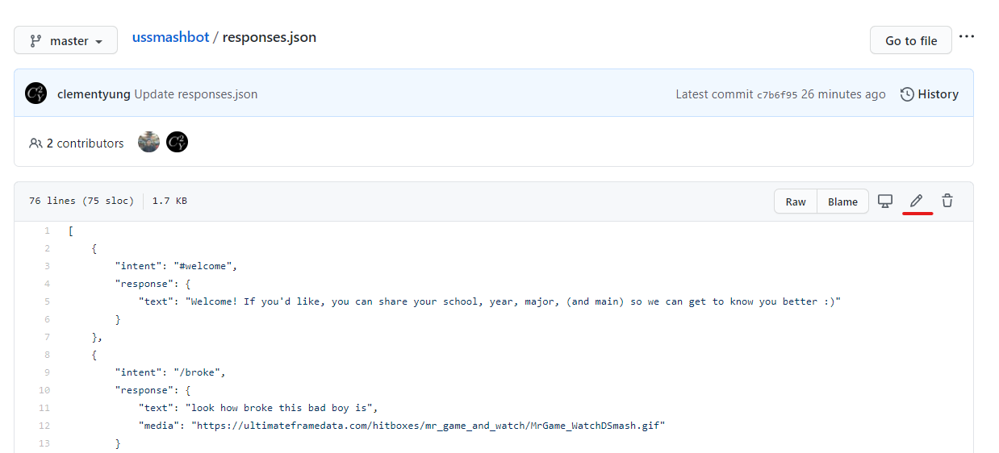
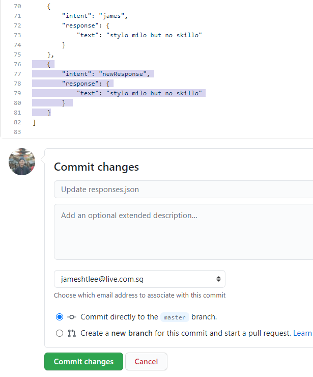

# Guide for non-technical contributions

There are 2 parts to making a bot respond to messages:

1. The bot has to know what to look out for. It has to detect the intent (or purpose) behind eevery message.
2. The bot has to know what to respond if it detects a certaint intent.

### LUIS (To add intents)

1. Please request for access to the LUIS account by sending me your email
2. Go to luis.ai and create account/sign in with that email. If you have a Microsoft email (including NUS), it's likely you can already sign in.
3. Click on `USSmash Bot`
4. Click on create under `Intents` at the top.

5. Name the intent in camelCase. Example: `ramen` or `captFalcon`
6. Add examples of the sentence.

7. Once done, click train at the top right.

8. Once training done, click publish to production slot.

### Github (To add responses)

1. Click on `responses.json`.
   

2. Click the edit icon at the top right.

3. Add in your response and propose changes. It has to be in this exact format, or it won't work. Copy paste to minimize mistakes, and make sure there are no extra commas or brackets afterwards.

4. Wait for your pull request to be approved.